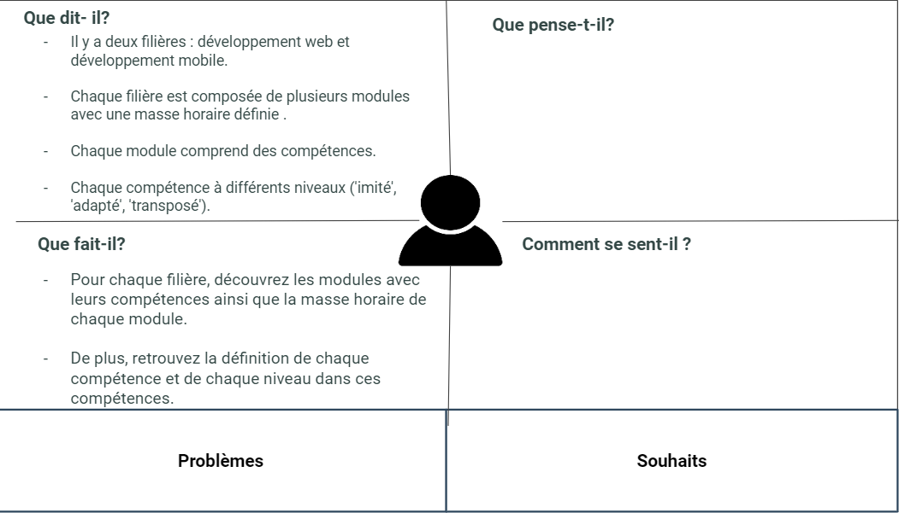

# Définir Problème

<!-- new slide -->

## Définir probleme 

{:width="500px"}*figure 1:Définir problem*

<!-- new slide -->

<!-- note -->

- Chaque formateur et responsable de formation devrait avoir une connaissance approfondie de chaque filière, des modules, des compétences et des niveaux correspondants, avec leurs définitions et leur masse horaire

# Idéation

<!-- new slide -->

## Idéation 

{:width="900px"}*figure 2:Idéation*

<!-- new slide -->

- Créer un système modulaire avec des modules spécifiques à différentes compétences et niveaux.

# Carte d'empathie 

<!-- new slide -->

## Persona :

Abdelmounaim Hammouda  

<!-- new slide -->

## Carte d'empathie 

{:width="900px"}*figure 3:Carte d'empathie responsable de formation*

<!-- new slide -->

<!-- note -->

## Ce qu'il dit : 

- Il y a deux filières : développement web et développement mobile.
- Chaque filière est composée de plusieurs modules avec une masse horaire définie .
- Chaque module comprend des compétences. 
- Chaque compétence à différents niveaux ('imité', 'adapté', 'transposé').

## Ce qu’il fait :

- Pour chaque filière, découvrez les modules avec leurs compétences ainsi que la masse horaire de chaque module.
- De plus, retrouvez la définition de chaque compétence et de chaque niveau dans ces compétences.