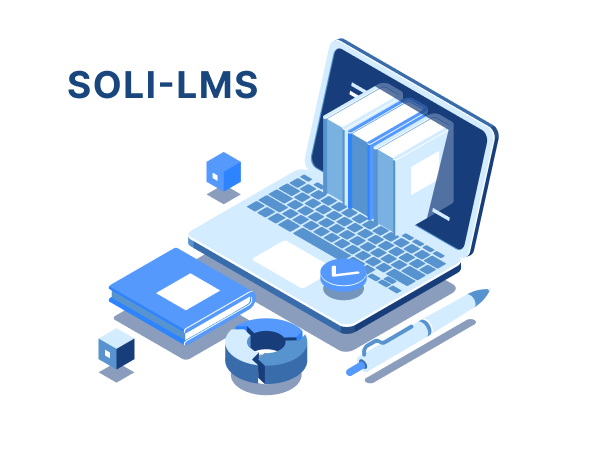

## Introduction

{:width="700px"}
*Figure 1: Introduction*

<!-- note -->

Le Centre Solidaires Digital SOLICODE s'engage à offrir des formations de qualité supérieure, accessibles à tous. Pour concrétiser cette ambition, le centre a mis en place Soli-LMS, un système de gestion d'apprentissage (LMS) complet et intuitif, destiné à révolutionner la gestion des formations.
Ce rapport, intitulé "File Rouge", se concentre sur un élément crucial de Soli-LMS: le package de création de projets. Ce package est un outil fondamental pour garantir que les projets de formation répondent aux normes de qualité attendues et que les apprenants reçoivent des projets pertinents, associés aux compétences nécessaires.
Mon travail au sein de ce projet a consisté à développer et à améliorer ce package. L'objectif principal était de simplifier la création de projets pour les formateurs, tout en assurant une flexibilité maximale et une intégration transparente avec les compétences visées.
Ce rapport présente les résultats de mon analyse, les conclusions clés, les recommandations et les axes d'amélioration pour le package de création de projets. Il met en lumière les avantages de ce package pour Soli-LMS et son impact positif sur la mission de SOLICODE.
Ce document est destiné aux membres de l'équipe de développement de Soli-LMS, aux formateurs et aux responsables du Centre Solidaires Digital SOLICODE. Il vise à permettre une meilleure compréhension du package de création de projets et à soutenir les efforts de développement futurs afin de garantir le succès de Soli-LMS et la réalisation des ambitions de SOLICODE.

<!-- new slide --> 

