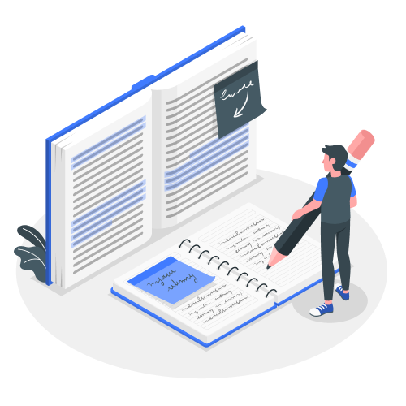

## Conclusion

{:width="700px"}
*Figure: Conclusion*

<!-- note -->
 
Ce projet de développement d'une plateforme de gestion de projets et d'apprentissage, bien que mené de manière individuelle, a permis de mettre en pratique une démarche collaborative et centrée sur l'utilisateur.  En adoptant des méthodologies agiles comme 2TUP, le Design Thinking et Scrum,  l'accent a été mis sur la compréhension des besoins des formateurs et sur la conception d'une solution répondant à leurs problématiques concrètes.

Le choix de technologies modernes et performantes telles que Laravel, PHP et MySQL garantit la robustesse et l'évolutivité de la plateforme.  L'architecture MVC assure quant à elle une structure claire et maintenable du code, favorisant ainsi l'intégration de nouvelles fonctionnalités dans le futur.

La phase de conception,  s'appuyant sur des diagrammes UML et des maquettes d'interface, a permis de formaliser la structure de la solution et de valider les choix ergonomiques. 

Ce projet, bien qu'à un stade de prototype,  démontre une  maîtrise des  compétences clés du développement web :

-  **Analyse et compréhension des besoins** 
- **Conception et modélisation de solutions**
- **Développement d'applications web robustes et évolutives** 
- **Travail en mode agile et gestion de projet efficace** 

L'accent mis sur  les bonnes pratiques de développement (tests unitaires, respect des interfaces) assure  la qualité et la pérennité du code.

Fort de cette expérience enrichissante,  je suis convaincu de pouvoir  relever de nouveaux défis et  contribuer activement au succès de projets ambitieux dans le domaine du développement web.

## Annexes

# Annexe 1 : Planning

 <!-- picture -->

# Annexe 2 : Conception

 <!-- maquette extra -->

