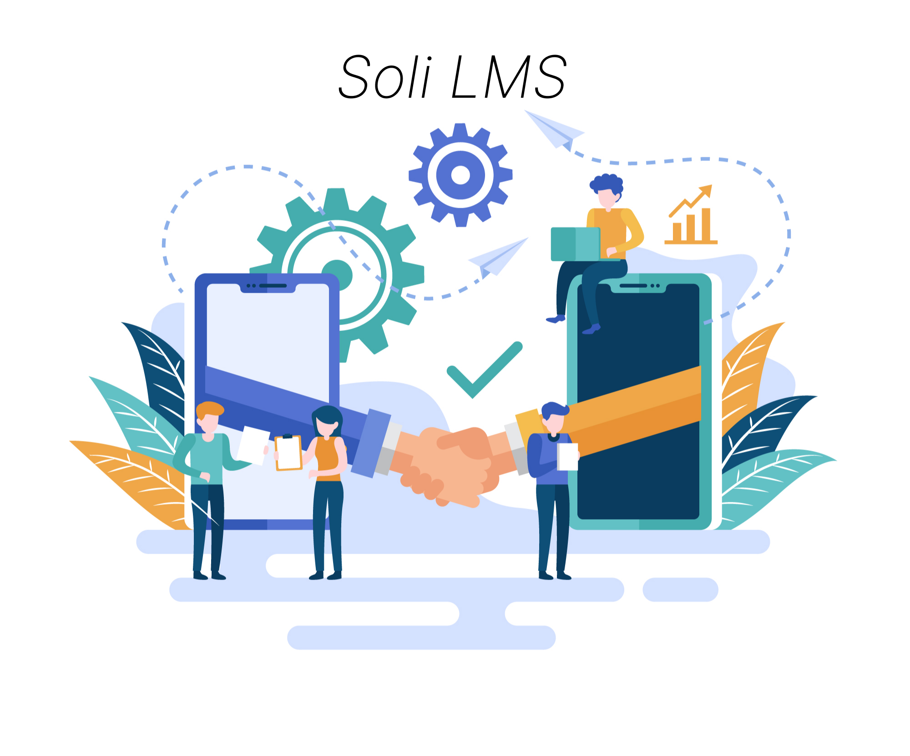

# Introduction

{:width="700px"}
*Figure 1: Introduction*

<!-- note -->

Soli-LMS (Learning Management System) est un système de gestion de la formation puissant et polyvalent conçu pour satisfaire les besoins variés des organismes de formation et des établissements d'enseignement.

Soli-LMS facilite également la gestion des ressources humaines, des modules de formation, des compétences, et des parcours d'autoformation, offrant ainsi une solution complète pour une gestion intégrée et efficace des formations. 

Dans la présentation de notre plateforme novatrice de gestion des formations, spécialement conçue pour répondre aux besoins des formateurs et accompagner le développement des compétences des apprenants.
<!-- new slide --> 
