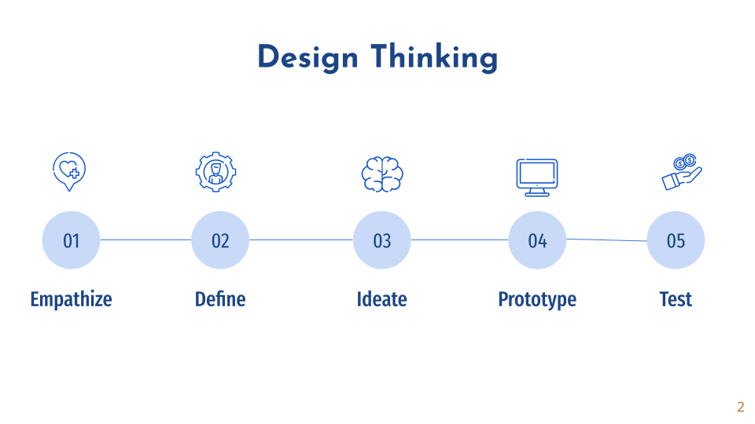

## Processus de développement
{:class="sectionHeader"}

<!-- note -->

Le développement de notre plateforme de gestion des formations repose sur une approche rigoureuse et structurée, combinant le meilleur des méthodes agiles 2TUP et du Design Thinking. Cette combinaison nous permet de garantir une solution à la fois fonctionnelle, ergonomique et parfaitement adaptée aux besoins réels des utilisateurs. 

<!-- new slide -->

## 2TUP (Two Tracks Unified Process) : Un développement en deux branches

{:width="70%"}
*figure: 2TUP*
       
<!-- note -->

2TUP est comme un plan d'architecte raffiné, une méthode basée sur le Processus Unifié, éprouvé et fiable. Tout commence par une analyse approfondie, une exploration méticuleuse des acteurs impliqués, de leurs besoins et de l'environnement dans lequel le système évoluera. 

Ensuite, la méthode se divise en deux voies parallèles : 

   - **La Voie Fonctionnelle :** C'est là que nous cartographions les capacités du système et élaborons des maquettes pour obtenir une vision claire. 
   - **La Voie Technique :**  Ici, nous définissons toutes les contraintes techniques, en identifiant les briques qui composeront l'architecture. 

Enfin, nous fusionnons ces voies, rassemblant le tout pour créer une solution sur mesure. C'est un processus systématique, qui culmine en codage et en tests rigoureux pour garantir que le système répond à toutes les exigences.  

**La Voie Fonctionnelle : Comprendre les besoins**

- Identification des acteurs (formateurs, apprenants, administrateurs) et de leurs interactions avec la plateforme.
- Formalisation des besoins et des fonctionnalités attendues.
- Modélisation des processus clés (création de projets, attribution de compétences,  validation,  etc.).
-  Création de maquettes d'interface (wireframes) pour visualiser l'expérience utilisateur.

**La Voie Technique : Bâtir les fondations** 

- Identification des contraintes techniques (environnement d'hébergement, sécurité,  performance).
- Choix des technologies les plus adaptées  (PHP, Laravel, MySQL,  etc.).
-  Définition de l'architecture technique de la plateforme (MVC).
-  Mise en place des outils de développement et de test. 

**La phase de réalisation : Convergence et concrétisation**

-  Fusion des éléments des branches fonctionnelle et technique.
-  Développement itératif et incrémental de la plateforme, en sprints.
-  Tests et validation des fonctionnalités à chaque étape du développement.
-  Livraison d'une solution fonctionnelle et conforme aux besoins.

<!-- new slide -->

## Design Thinking : l'humain au cœur du processus

{:width="1000px"}
_figure: Design thinking_

<!-- note -->

Le Design Thinking,  approche centrée sur l'utilisateur,  nourrit chaque étape de notre développement :

- **Empathie :**  Comprendre en profondeur les besoins, les frustrations et les motivations des formateurs.
- **Définition :**  Définir clairement le problème à résoudre et les objectifs à atteindre.
- **Idéation :**  Générer un maximum d'idées et de solutions possibles. 
- **Prototypage :**  Créer des prototypes (maquettes,  versions simplifiées) pour tester les idées et recueillir des retours. 
- **Test :**  Faire tester les prototypes par les utilisateurs finaux pour identifier les points forts et les axes d'amélioration. 

En combinant 2TUP et Design Thinking,  nous nous assurons de développer une plateforme  qui répond  non seulement  aux besoins fonctionnels,  mais aussi aux attentes et aux préférences des utilisateurs,  offrant ainsi une expérience optimale. 

<!-- new slide -->

## La Construction Logicielle : Plans et Outils
{:class="sectionHeader"}

<!-- note -->

Le développement logiciel est comparable à la construction d'un chef-d'œuvre numérique. Il s'agit d'une série d'étapes méticuleusement orchestrées, une feuille de route pour donner vie à un système ou le remodeler. Ce chapitre vous emmène dans un voyage à travers deux approches puissantes : 2TUP et Design Thinking, chacune ayant son propre style et expertise unique.

<!-- new slide -->

## Le Développement Agile : Une Approche Adaptative

{:class="sectionHeader"}

<!-- note -->

Le développement Agile est comme une danse de flexibilité et d'itération.  Il s'agit de livrer des versions fonctionnelles de logiciels à intervalles réguliers, en s'adaptant en permanence aux besoins changeants des utilisateurs.

Ce chapitre explore le cœur de l'Agile, ses avantages et ses limites. Nous plongerons ensuite dans Scrum, une méthodologie Agile populaire, en examinant ses rôles clés, ses événements, ses artefacts et les meilleures pratiques pour garantir le succès des projets Scrum.

{:width="700px"}*figure: Méthode agile*

<!-- new slide -->