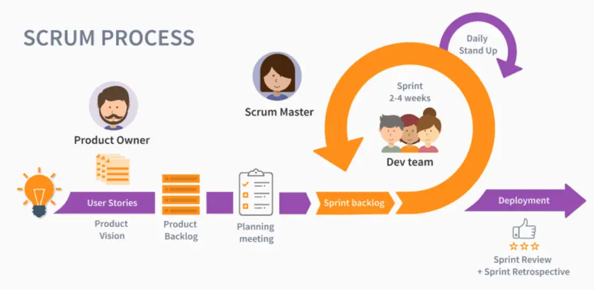

# Branch Fonctionnel

## Carte d'empathie avec Mr Hamouda - Responsable Formation

{:width="70%"}
*Figure: Carte d'empathie avec Mr Hamouda - Responsable Formation - pkg_rh*

## Definire le problème

*Figure: Definire le problème*

Le Responsable de Formation rencontre des difficultés majeures avec l'utilisation d'Excel pour la gestion des données éducatives. La gestion des étudiants et des formateurs est fastidieuse et sujette aux erreurs, et la validation des compétences des étudiants manque de transparence et d'efficacité.

De plus, l'ajout et l'organisation des groupes et des spécialités sont complexes et chronophages, rendant difficile le maintien d'un système à jour.

## Processus de Développement

### Méthode 2TUP

{:width="70%"}
*Figure: Méthode 2TUP*

## Méthode Agile - SCRUM

{:width="700px"}*figure: Méthode agile - Scrum*

En ingénierie logicielle, les pratiques agiles mettent en avant la collaboration entre des équipes auto-organisées et pluridisciplinaires et leurs clients. Elles s'appuient sur l'utilisation d'un cadre méthodologique léger mais suffisant centré sur l'humain et la communication.