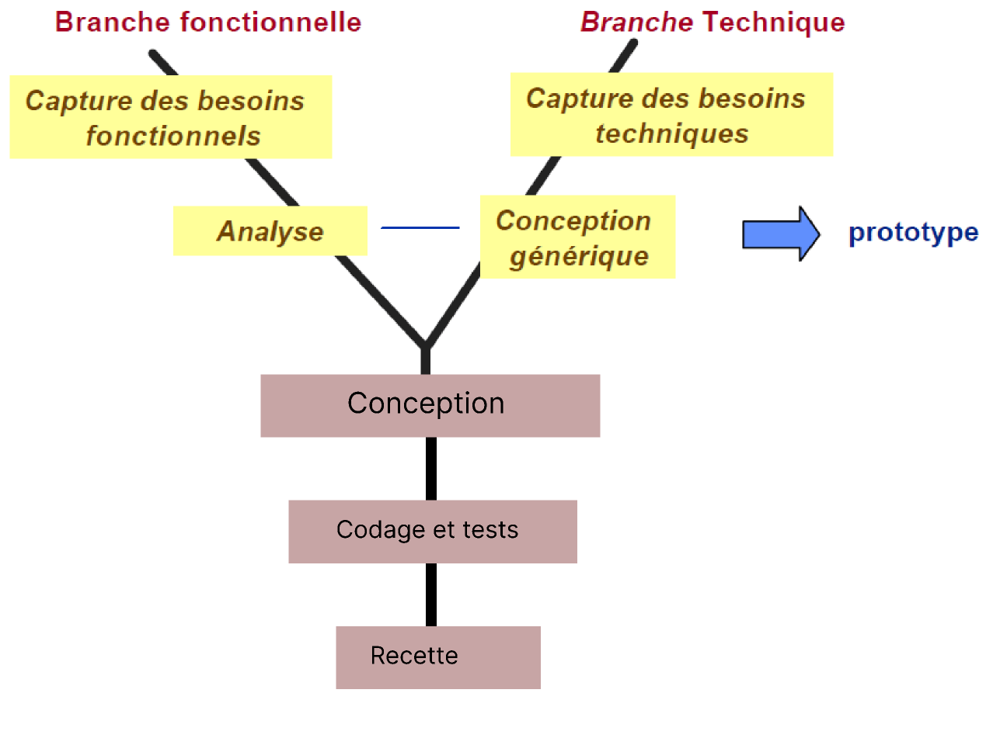
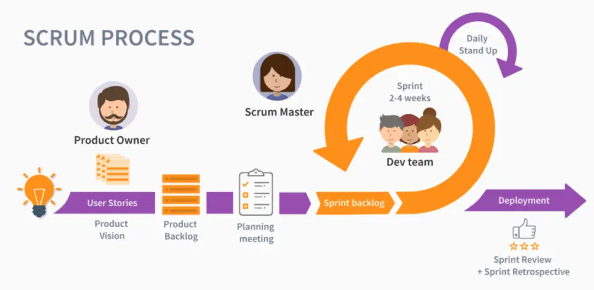
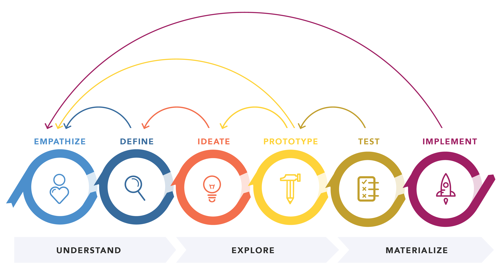

# Context de Projet

## Cahier de Charge

## Objectifs de formation

L'objectif de cette formation en développement web est de fournir aux participants les compétences et les connaissances nécessaires pour concevoir, développer et maintenir des sites web modernes et interactifs. Les participants apprendront à utiliser des langages de programmation pour créer des interfaces utilisateur dynamiques et réactives. Ils seront également formés à l'utilisation de frameworks et bibliothèques populaires, tels que Laravel, ainsi qu'à des technologies de backend comme PHP et MySQL pour développer des applications web complètes et performantes.

En plus des aspects techniques, cette formation intègre des méthodologies de gestion de projet modernes, notamment la méthodologie Agile et le framework Scrum, pour assurer une gestion efficace et flexible des projets web. Les participants apprendront à collaborer efficacement au sein d'équipes de développement, en utilisant des outils de versionnement et de collaboration pour gérer les projets de manière productive.

À la fin de cette formation, les participants seront capables de :

- Maîtriser les principes fondamentaux du développement web front-end et back-end.
- Concevoir des interfaces utilisateur intuitives et adaptatives pour différents appareils et tailles d'écran.
- Utiliser le framework Laravel pour développer des applications web robustes et évolutives.
- Gérer et manipuler des bases de données relationnelles avec MySQL.
- Appliquer les principes et pratiques de la méthodologie Agile et du framework Scrum pour la gestion de projets.
- Collaborer efficacement avec des équipes de développement, en utilisant des outils de versionnement et de gestion de projet.

# Processus de Développement

## Méthode 2TUP

{:width="70%"}
*Figure: Méthode 2TUP*

## Méthode Agile - SCRUM

{:width="700px"}*figure: Méthode agile - Scrum*

Scrum est un cadre de gestion de projet agile utilisé pour développer des produits de manière flexible. Il se caractérise par des itérations courtes appelées "sprints", favorisant la collaboration et l'adaptabilité. Scrum permet une livraison régulière de valeur aux clients grâce à des réunions régulières et un processus itératif.

## Design Thinking

{:width="700px"}*figure: Design Thinking*

Le design thinking est une approche d'innovation axée sur l'humain. Cette méthode de conception holistique place l'utilisateur au centre du processus, avec pour objectif de développer des produits ou services novateurs.
