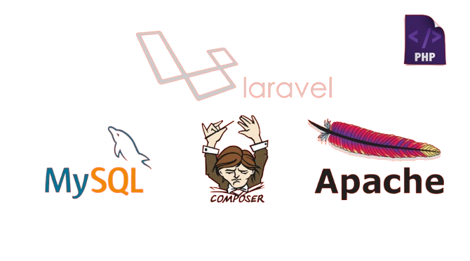

# Branch Techniques

## Analyse Techniques

*Figure: Analyse Techniques*

Pour le développement du prototype, nous utiliserons diverses technologies, parmi lesquelles :

PHP : un langage de script côté serveur. Rôle : gérer la logique métier de l’application, traiter les requêtes et générer des pages dynamiques.
MySQL : une base de données relationnelle. Rôle : stocker et gérer les données de l’application.
Laravel : un framework PHP. Rôle : simplifier le développement en fournissant une structure MVC, des outils de migration de base de données, etc.
AdminLTE : un thème d’administration basé sur Bootstrap. Rôle : offrir une interface utilisateur moderne et réactive pour la gestion de l’application.

## Architecture MVC

*Figure: Architecture MVC*

L'architecture MVC (Modèle-Vue-Contrôleur) est une approche de conception qui divise une application en trois composants distincts, ce qui facilite la maintenance et l'évolution du code. Le Modèle s'occupe de la gestion des données, la Vue présente ces données à l'utilisateur, et le Contrôleur gère les interactions entre l'utilisateur et l'application. Utilisée couramment dans le développement de sites web, d'applications mobiles et autres logiciels, cette architecture améliore l'organisation du code, permet une meilleure réutilisabilité et simplifie la maintenance.

## Prototype
