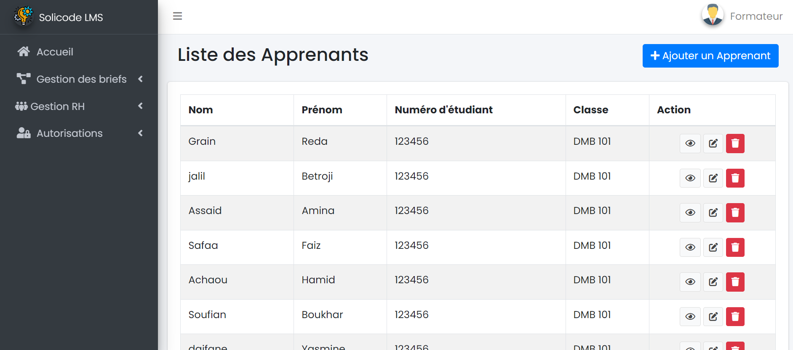
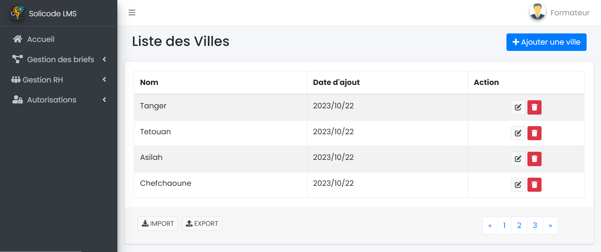
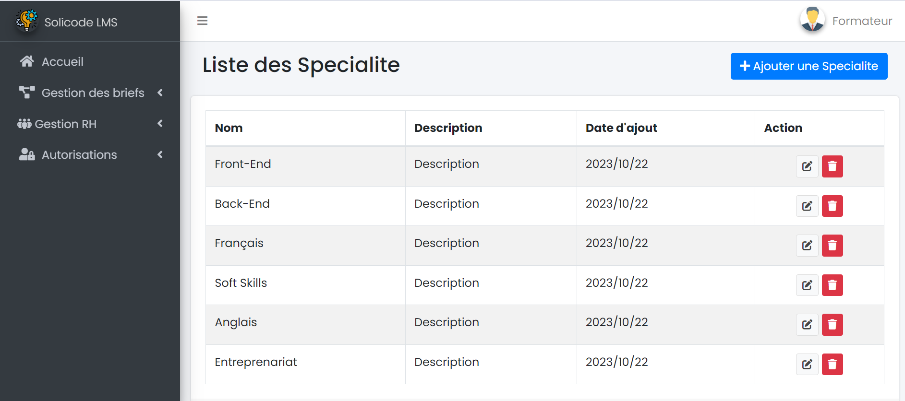

# Conception

## Diagramme de classes

{:width="100%"}
*Conception - pkg_rh*

## Maquettes

### Gestion Formateurs

{:width="100%"}
*Gestion Formateurs*

### Gestion Apprenant

{:width="100%"}
*Gestion Apprenant*

### Gestion Villes

{:width="100%"}
*Gestion Villes*

### Gestion Groupes

{:width="100%"}
*Gestion Groupes*

### Gestion Spécialités

{:width="100%"}
*Gestion Spécialités*

### Gestion Niveau Scolaire

{:width="100%"}
*Gestion Niveau Scolaire*