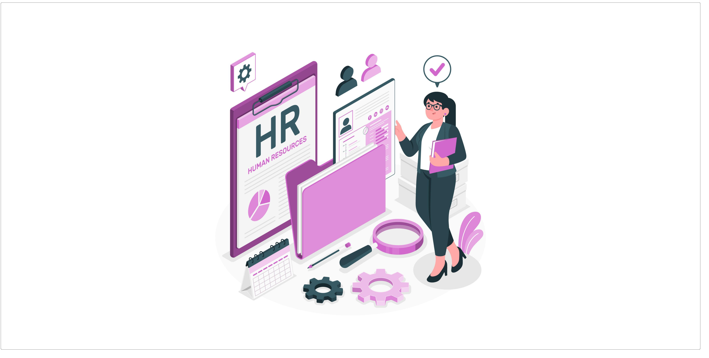

# Introduction

*Figure: Introduction*

<!-- note -->

L'application Gestion RH fait partie intégrante du projet SoliLMS, le système de gestion de l'apprentissage du Centre de SoliCode.

Destinée à optimiser la gestion des ressources humaines, elle centralise les informations sur les employés, automatise les processus administratifs et améliore la communication interne.

Cette solution innovante permet au Centre de SoliCode de se concentrer sur sa mission principale : offrir une formation de qualité et un soutien continu à ses apprenants.
