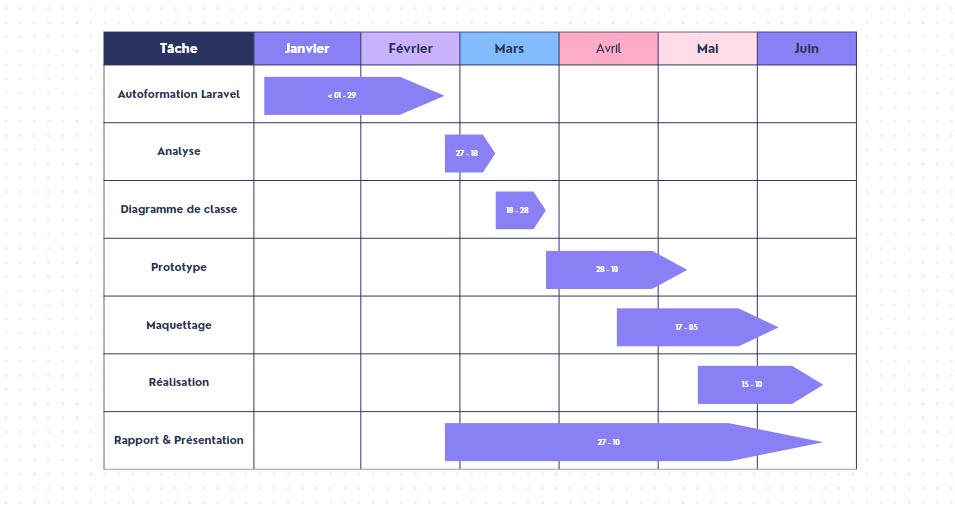

# Planification

Pour garantir la réussite de notre projet, il est essentiel d'élaborer un plan détaillé répertoriant toutes les tâches à accomplir en utilisant la méthode que nous avons précédemment présentée. Ce plan nous fournira une vue d'ensemble du projet, permettra de définir clairement les objectifs et d'identifier les ressources nécessaires pour chaque tâche.

## Diagramme de Gantt

Un diagramme de Gantt est un outil de gestion de projet qui montre la planification de toutes les tâches d’un projet sur une ligne de temps.

{:width="100%"}
*Diagramme de Gantt*
